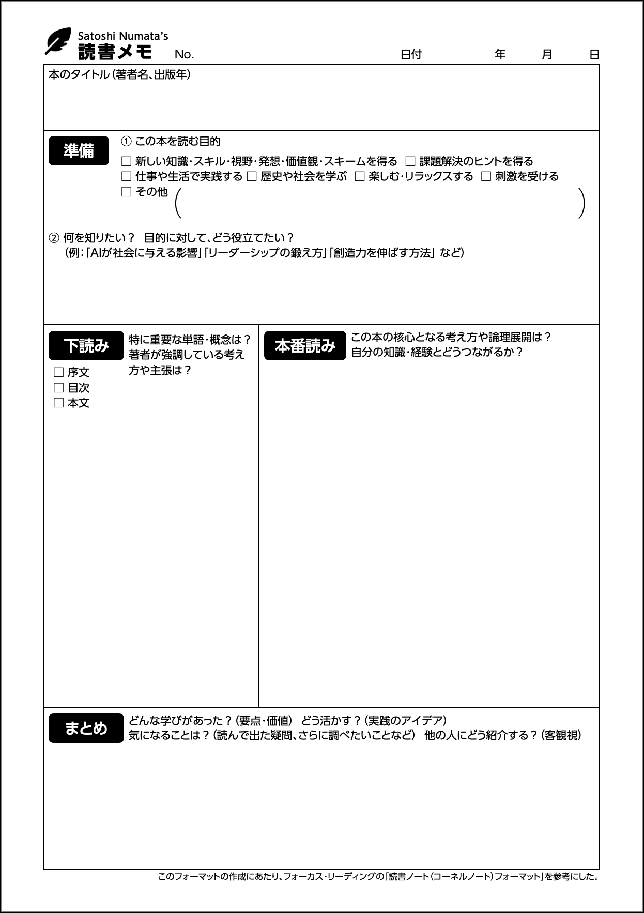

<link href="https://satoshi-numata.github.io/notes/custom.css" rel="stylesheet">
<link href="https://use.fontawesome.com/releases/v6.7.2/css/all.css" rel="stylesheet">

## 読書メモの取り方

/ (作成日：2025年3月18日、最終更新日：2025年3月18日)/

### 読書メモ

小説では当てはまらないこともありますが、知識を得るために読書する場合、いくつかのポイントがあります。

読書は、「準備」→「下読み」→「本番読み」の3段階で行います。

#### 準備段階

- 「本のカバー」から得られる情報から、自分がイメージすることを読書メモの「準備」欄にメモしておく。
  - なぜその本を買ったのかも、忘れないうちに「準備」欄に書いておく。
- 「はじめに」をしっかりと読む
  - 著者が伝えたいことなどを、読書メモの「下読み」にメモしておく。
- 「目次」をしっかりと読む
  - 「目次」の章レベルに目を通して流れを理解する。
    - 気になったキーワードがあれば、読書メモの「下読み」にメモしておく。
  - 「目次」の節レベルに目を通して流れを理解する。
    - 気になったキーワードがあれば、読書メモの「下読み」にメモしておく。

これを最初にやっておくことで、読書のための **大雑把なマップ** を手に入れることができます。

#### 下読み段階

次に、本のカバーと目次を読んで、「準備」欄と「下読み」欄にメモしたことを中心に、パラパラと早めに良いテンポで、全体に目を通していきます。このとき、時間を決めて読むことと、BPM100程度のテンポの良いBGMやメトロノームをかけておくと、読書の補助になります。このとき、全体のボリューム感や現在地点をコントロールしやすいのは「紙の本」でしょう。読んでいる本のメディアを意識して、後述するように、メディアに合わせた読み方をしていくことも大事です。

こうしてパラパラと読んでいる中で、新たなキーワードが出てきたら「下読み」欄にメモを追加し、また既にメモしたキーワードに関連するして気になることが出てきたら「下読み」欄に追記して、「下読み」欄を充実させていきます。

下読みを終えた段階では、読書のための **詳細なマップ** が出来上がっています。

#### 本番読み

「本番読み」では、下読みで出来上がった「詳細なマップ」を元に読んでいくことで、スピーディーに眠くなりにくく読み進めることができます。気になるところを集中的に読んでも良いでしょう。

また、「大雑把なマップ」と「詳細なマップ」の両方が出来上がっていることで、自分がその本を読む目的も、かなり精緻化されているので、読みやすさは格段に上がっています。

本番読みをしながら、その本の核心となる考え方・論理展開、過去の知識や経験とのつながり、といった「自分が得たもの」を「本番読み」欄に言葉にしてまとめていきます。

#### 読書メモの例

私は次のような読書メモのテンプレートを作って使っています。

メモごとに番号を割り振ることで、1ヶ月や1年といった単位で、何冊読んだのかを把握しやすくなります。

- [読書メモのダウンロード (PDF)](reading-note_20250318_1533.pdf)

### ひと区切りごとにメモを取る

#### 紙の本の場合

紙の本であれば、1章読み終えるごとに読書メモを取ることで、その章から自分が学んだことは何だったのかをしっかりと振り返り、本から得た知識や気づいたことを定着させることができます。

#### 電子書籍の場合

電子書籍の場合、紙の本よりも情報が抜け落ちやすくなります。これは、本の中の文字情報が、紙の厚みの中の「1ページ」という物理的な位置情報と結びつかないためです。紙の本では、ページをめくる動作が手触りを伴うため、読んでいる位置の変化を把握しやすくなります。また、視覚的にも手触りでも「どの情報がどこに記載されているか」を記憶しやすいため、本の内容を効果的に取り入れる際の手がかりになります。

そのため、電子書籍では、5〜10ページごと、数段落ごと、または節ごとに読書メモを取るのが効果的です。

#### オーディオブックの場合

オーディオブックは、移動中や家事をしながらでも学べて時間を有効活用できますし、単なるテキストに加えてリズムやイントネーションが加わるため、より記憶に残りやすい場合があります。また、通常の本とは違って読み飛ばしができないため、目で読む読書では読み飛ばしてしまう自分のクセが出にくいという利点もあります。目で読む読書は難しくても、耳で聞く読書はスッと入ってくるという人も多いと聞きます。

その反面、オーディオブックからは次々に新しい情報が読み上げられてやってきますので、細かい部分を忘れやすいことが多いでしょう。また、どこに書いてあった（いつ読まれたか）も分かりにくく、あとから情報に再アクセスするのが難しいのがオーディオブックの特性と言えます。

そのため、オーディオブックを聞いている場合は、小さなメモ帳を手元に用意して、なるべくタイムスタンプをつけながら、キーワードをメモできるようにしておくと良いでしょう。そして、オーディオブックについて振り返るまとまった時間を定期的に取り、キーワードをメモした時点で感じていたことを読書メモに文字化します。

#### 動画の場合

プログラミング、料理、DIYなどの分野の場合、YouTubeなどの動画メディアは、実際に操作している画面などをアニメーション付きで確認できて、紙の本よりも理解しやすいことが多いでしょう。また紙の本と対比させた場合、テキストで示された論理展開を読み解いていくのが紙の本での情報接種の形態であるのに対して、動画メディアは、目の前で起きたアクションや耳で聞こえてきた音に対して直接的に反応したり、動くイメージを記憶したりできるのが特徴であると言えます。

ただし動画は、オーディオブックと同様に、次々に新しい情報がやってきますし、映像（絵やアニメーション）・音声・テキストが同時に入ってきて情報が圧倒的に多いため、流れていく情報が一度に処理しづらいのが難しいメディアです。また、身振り・手振りや表情・声のイントネーション・反応のタイミングといった演者のアクションだけで「面白い」と即時反応してしまうことが多く、本当に重要なポイントは何だったのかという記憶が、時間が経つほどズレていってしまう問題も起こりやすいと言えます。「面白いリアクションばかり覚えていて、肝心のテクニックや理論といった内容は忘れている」ことも多いのではないでしょうか。

そのため、5分に1つキーワードをメモするなど、自分なりのルールを決めて動画を視聴すると良いでしょう。オーディオブックと同じく、振り返る時間を作り、キーワードを元に読書メモに整理しておくと理解が深まります。

### 「未完了を完了させる。」

東洋思想の専門家の方から、「『未完了を完了させる』ことを意識しなさい」と教わったことがあります。

つまり、言葉にしてまとめていなくて、未完了のままの状態のものは、いつまでもモヤモヤして思い出してしまうものでありつづける。それに対して、言葉にして、綺麗に終わらせると、そのことはスパッと終わって、新しいことに取り組みやすくなる、ということです。

まとまった区切りごとに読書メモをまとめていって、読後の感想を文字にして、読書をしっかりと「終える」ことも、同様に重要です。

#### 未完了のままの情報は、頭の中でモヤモヤし続ける

私たちは本を読んだり動画を見たりして、多くの情報を得ます。しかし、「言葉にしてまとめる」ことをしないまま放置すると、それは未完了のまま、頭の中でぐるぐると留まり続けるのですね。

例えば、

- 本を読んだけど、感想やポイントをまとめていない → 「あれ、あの本で何を学んだんだっけ？」と気になる
- 動画を見たけど、メモを取らなかった → 「面白かったけど、何が重要だったんだっけ？」と断片的に思い出す
- オーディオブックを聴いたけど、振り返る時間を取らなかった → 「良いこと言ってた気がするけど、具体的に何だったっけ？」とすっきりしない

これらはすべて、「未完了のままの情報」が脳の中でくすぶっている状態です。

#### 言葉にしてまとめることで、スパッと終わらせられる

このモヤモヤを解消するには、言葉にして「完了させる」ことが大切です。

- 読書メモを書く → 「この本では〇〇を学んだ」と整理することで、情報が定着し、終わらせられる
- 動画のキーワードをまとめる → 「この動画で学んだポイントは〇〇だった」と言葉にすると、すっきりする
- オーディオブックを振り返る → 「この音声で一番大事だったのは〇〇だ」と言葉にすると、新しいことに集中できる

これは単なる情報整理の話ではなく、**「未完了のものを、完了へと変える」**という心の整理にもつながっているのですね。

